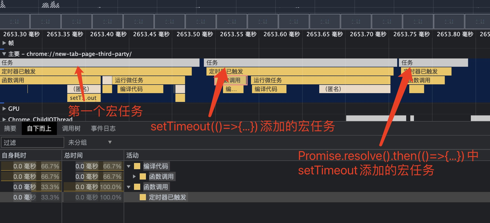

## Promise、宏任务、微任务相关易错点汇总

`Promise`相关面试题除去手写题（相关内容参考[手写`Promise`](https://github.com/goblin-pitcher/steel-wheel-run/blob/master/Promise%20A%2B%20and%20static%20method/promise.js)），最常考的就是输出结果顺序。

该部分为`Promise`输出结果相关易错点的理解和解析。

### async/await相关输出

```javascript
async function f1() {
  console.log(1)
	await f2()
  console.log(3)
}
async function f2() {
	console.log(2)
}
Promise.resolve().then(()=>{
  console.log(4)
})
f1()
console.log('start')

// 最后输出为：1 2 start 4 3
```

如果没有async/await，只有Promise，这里理解起来会容易很多。因此这里易错点分两部分：

+ 如何将async/await转义为Promise表达式
+ `new Promise(fn)`中`fn`函数何时执行

#### async/await 的转义

愿函数

```javascript
async function f1() {
  console.log(1)
	await f2()
  console.log(3)
}
async function f2() {
	console.log(2)
}
```

转义后

```javascript
function f1() {
  return new Promise((resolve)=>{
    console.log(1)
    const p = f2()
    p.then(()=>{
      console.log(3)
      resolve()
    })
  })
}
function f2() {
  return new Promise((resolve)=>{
    console.log(2)
    resolve()
  })
}
f1() // 1 2 3
```

转义后的代码，执行f1时，顺着Promise的链路，很容易判断输出结果是`1 2 3`

#### `new Promise(fn)`中`fn`函数何时执行

之前项目中有按照Promise A+协议实现自定义的Promise(参考[地址](https://github.com/goblin-pitcher/steel-wheel-run/blob/master/Promise%20A%2B%20and%20static%20method/promise.js))，主要看这么一段：

```javascript
class MyPromise {
  status = statusEnum.PENDING;
  resArr = [];
  rejArr = [];
  value = null;
  reason = null;
  constructor(fn) {
    const resolve = (val) => {
      // ...
    };
    const reject = (val) => {
      // ...
    };
    try {
      fn(resolve, reject);
    } catch (err) {
      reject(err);
    }
  }
  then(onResolve, onReject) {
    // ...
  }
  catch(onReject) {
    // ...
  }
}
```

可以看到，`new Promise(fn)`时，`fn`在`constructor`中立即执行，即可以将其看作同步代码。再看之前的示例，结合转义后的结果，输出更容易理解

```javascript
async function f1() {
  console.log(1) // 在f1返回的Promise对象的construstor中立即执行
	await f2()
  console.log(3)  // 塞入微任务
}
async function f2() {
	console.log(2) // 在f2返回的Promise对象的construstor中立即执行
}
Promise.resolve().then(()=>{  // 塞入微任务
  console.log(4)
})
f1() // 先输出立即执行的结果 1 2
console.log('start') // 输出立即执行的结果 start
// 执行微任务阶段，此时微任务队列为[()=>{console.log(4)}, ()=>{console.log(3)}]
// 执行微任务队列，输出 4 3
```


### 宏任务和`js`线程时间片

```javascript
Promise.resolve().then(()=>{
    setTimeout(()=>{
        console.log(2)
    })
})
setTimeout(()=>{
    Promise.resolve().then(()=>{
        console.log(1)
    })
})
// 输出 1 2
```

分析以上代码，先看第一个宏任务阶段执行的内容

```javascript
// 假设存在pushToNextMacroTask方法，将function推入下一个宏任务执行

// 第一个宏任务阶段
const microTask = []
microTask.push(()=>{
  setTimeout(()=>{
    console.log(2)
  })
})
pushToNextMacroTask(()=>{
    Promise.resolve().then(()=>{
        console.log(1)
    })
}, 0)
// 执行第一个宏任务的微任务阶段
microTask.forEach(func => func())
/**
 * 此时执行了如下内容
 * pushToNextMacroTask(()=>{
    console.log(2)
  }, 0)
 */
```

这里开始存在一个**分歧点**，第一个宏任务阶段，分别执行了两次`pushToNextMacroTask`，将方法推至下一个宏任务，那么**下一个宏任务**是否是同一个宏任务？对该部分代码打`Performance`快照后，结果如下：



可以发现，虽然两个`setTimeout`定时的时间都是0，但并不会将任务放到同一个宏任务中。最终结果解析如下：

```javascript
Promise.resolve().then(()=>{
    setTimeout(()=>{
        console.log(2)
    })
})
setTimeout(()=>{
    Promise.resolve().then(()=>{
        console.log(1)
    })
})

/**
 * 假设宏任务列表：macroTaskList = []
 * 假设微任务列表：microTaskList = []
 * 1. 第一个宏任务阶段
 * 执行Promise.resolve().then,将其回调塞入微任务队列
 * microTaskList = [
 *  ()=>{
 *   setTimeout(()=>{
 *      console.log(2)
 *   })
 *  }
 * ]
 * 执行setTimeout, 将其回调函数放入下一个宏任务
 * macroTaskList = [
 *  ()=>{console.log(1)}
 * ]
 * 1.1 第一个宏任务的微任务阶段
 * const microTask = macroTaskList.shift()
 * microTask()
 * 执行setTimeout，将其回调塞入下一个宏任务
 * macroTaskList = [
 *  ()=>{console.log(1)},
 *  ()=>{console.log(2)}
 * ]
 * 2. 第二个宏任务阶段
 * const macroTask = macroTaskList/shift()
 * macroTask() // 输出1
 * 2.2 第二个宏任务的微任务阶段，没有微任务
 * 3. 第三个宏任务阶段
 * const macroTask = macroTaskList/shift()
 * macroTask() // 输出2
 * 
 * 总结：
 * 输出 1 2
 */
```

`js`线程和渲染线程互斥，浏览器分配给**`js`线程执行的一个时间片中，包含多个宏任务**。先后执行两次`setTimeout(fn, 0)`，两个`fn`会分别放入两个宏任务中，而非同一个宏任务。


